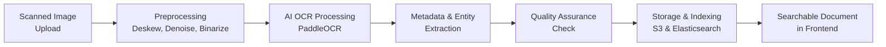

Here is a comprehensive technical product specification for your document management system, incorporating your requirements for processing 4 million financial and legal documents with Python, PostgreSQL, granular permissions, and open-source AI.

### **1. System Overview & Core Principles**
This system is designed to ingest, process, secure, and analyze millions of financial documents (invoices, receipts, contracts, POs, HR records) over a 20+ year span. It is built on a **Python/PostgreSQL backend** with a microservices architecture, prioritizing **data integrity, granular security, and scalable, open-source AI processing**.

### **2. System Architecture & Core Components**
The system is decomposed into independent, scalable services communicating via a message queue (e.g., RabbitMQ, AWS SQS).

| **Component** | **Technology / Tool** | **Primary Responsibility** |
| :--- | :--- | :--- |
| **Ingestion Service** | Python (FastAPI/Flask) | Watch scan directories, validate files, create database entries, publish jobs. |
| **Preprocessing Pipeline** | Python, OpenCV, Pillow, Unpaper | Deskew, denoise, binarize, and enhance scanned images to maximize OCR accuracy. |
| **OCR & AI Engine** | **PaddleOCR** (Primary), Tesseract (Fallback) | Extract text and layout. PaddleOCR is selected for its balance of accuracy, table/structure recognition, and multilingual support. |
| **Metadata Extraction** | Python, SpaCy | Use NLP to extract key entities (dates, names, amounts) from OCR text for tagging. |
| **Indexing Service** | Python, Elasticsearch/OpenSearch | Create searchable indexes from extracted text and metadata for fast retrieval. |
| **Storage Service** | Python (Boto3), AWS S3 | Manage storage of original images, processed PDFs, and system assets across S3 storage classes. |
| **API Gateway & Auth** | Python (FastAPI), OAuth2, JWT | Provide secure RESTful API, handle authentication and authorization. |
| **Frontend Application** | JavaScript Framework (React/Vue) | Provide user interface for search, document viewing, and administration. |
| **Database** | PostgreSQL 14+ | Store all document metadata, user data, permissions, and system relationships. |

### **3. Document Processing Pipeline**

*   **Phase 1 - Ingestion & Preprocessing**: Images from the scanner directory are picked up, assigned a unique ID, and undergo critical preprocessing (deskewing, noise removal, binarization) using tools like OpenCV and Unpaper. This step is vital for achieving high OCR accuracy, especially with older documents.
*   **Phase 2 - OCR & Data Extraction**: Preprocessed images are sent to the **PaddleOCR** engine. It extracts raw text and preserves layout (tables, forms). The text is then passed to an NLP model (SpaCy) to extract structured metadata (e.g., `vendor_name`, `invoice_date`, `total_amount`).
*   **Phase 3 - Storage & Indexing**: The original image is stored in an **S3 Deep Archive** bucket. A searchable PDF (text-over-image) is stored in **S3 Standard**. All extracted text, metadata, and storage pointers are saved in PostgreSQL. Text and key fields are indexed in **Elasticsearch** for high-speed search.
*   **Phase 4 - Search & Retrieval**: User queries hit Elasticsearch via the API. The system checks permissions, returns results, and retrieves the viewable PDF from S3 for display.

### **4. PostgreSQL Database Schema (Core Tables)**
```sql
-- Core document record
CREATE TABLE documents (
    id UUID PRIMARY KEY,
    original_filename VARCHAR(512),
    document_type VARCHAR(50), -- e.g., 'invoice', 'employment_contract'
    department_owner VARCHAR(50), -- 'legal', 'hr', 'finance'
    s3_key_original VARCHAR(1024), -- Pointer to S3
    s3_key_pdf VARCHAR(1024),
    ocr_raw_text TEXT,
    scan_date TIMESTAMP,
    processed_date TIMESTAMP
);
-- Extracted metadata
CREATE TABLE document_metadata (
    id SERIAL PRIMARY KEY,
    document_id UUID REFERENCES documents(id) ON DELETE CASCADE,
    field_name VARCHAR(100), -- e.g., 'client_name', 'effective_date'
    field_value TEXT
);
-- Permission heart
CREATE TABLE department_access_rules (
    id SERIAL PRIMARY KEY,
    department_name VARCHAR(50) UNIQUE, -- 'hr', 'legal'
    allowed_document_types TEXT[] -- Array of types this dept can access
);
```
*   **Documents & Metadata**: The `documents` table is the central log. The `document_metadata` table enables filtering by extracted data (e.g., `WHERE field_name = 'account_number' AND field_value = 'ACC123'`).
*   **Granular Permission Foundation**: The `department_access_rules` table is key. It defines which document types (e.g., `employment_contract`) are accessible by which departments (e.g., `hr`). This forms the basis for all row-level security.

### **5. AI & OCR Model Selection & Justification**
For a self-hosted, open-source solution, a hybrid OCR approach is recommended based on the document type.

| **Model** | **License** | **Recommended Use Case** | **Justification** |
| :--- | :--- | :--- | :--- |
| **PaddleOCR** | Apache-2.0 | **Primary Engine**: Invoices, receipts, contracts with tables. | High accuracy, excellent layout/table recognition (PP-StructureV3), strong multilingual support. Best for structured financial docs. |
| **Tesseract** | Apache-2.0 | **Fallback Engine**: Simple, printed text documents. | Extremely mature, runs well on CPU, broad language support. A reliable backup. |
| **Surya (via Datalab Marker)** | OpenRAIL | Complex layouts with multi-column text, code, or equations. | Excellent end-to-end document-to-Markdown/JSON conversion for tricky layouts. |
**Implementation Note**: Start with a **benchmarking exercise** as Brex did. Process a representative sample of 500-1000 of your documents with PaddleOCR and Tesseract to establish a baseline accuracy metric before full-scale deployment.

### **6. Security & Permission Model**
Granular security is enforced at multiple levels:
1.  **Role-Based Access Control (RBAC)**: Users belong to a `department` (e.g., `hr_member`, `legal_lead`).
2.  **Department-Level Rules**: The `department_access_rules` table is the primary gatekeeper. A query always appends: `WHERE documents.department_owner IN user_allowed_departments`.
3.  **Document-Type Filtering**: Within a department, further restrictions can be applied based on `document_type`.
4.  **Field-Level Security (Optional)**: For highly sensitive documents, certain extracted metadata fields (e.g., `salary_amount` in an HR doc) can be redacted for non-authorized roles at the application layer.

### **7. Key Technical Considerations & Implementation Roadmap**
*   **Preprocessing is Non-Negotiable**: Dedicate significant effort to image cleanup. The ROI in OCR accuracy is immense. Implement a dedicated preprocessing service.
*   **Batch Processing for Scale**: Use a job queue (Celery) to manage the pipeline. Processing 4 million pages requires parallel, fault-tolerant workflows.
*   **Search Strategy**: Use **Elasticsearch** for full-text search across OCR text and **PostgreSQL** for complex queries on structured metadata. Sync data via the application or a change-data-capture tool.
*   **Compliance & Audit**: Enable S3 Object Lock for WORM storage of original scans. Log all document access, views, and downloads to a separate audit table.

**Phase 1 (Months 1-3): Foundation**
Set up core infrastructure (AWS, PostgreSQL, Elasticsearch). Develop the preprocessing and PaddleOCR pipeline. Finalize the document taxonomy and permission matrix. Run a pilot on 50k documents.
**Phase 2 (Months 4-6): Scale & Secure**
Build the ingestion API, search service, and frontend. Implement the full RBAC and department security model. Begin full-scale processing of document backlog.
**Phase 3 (Months 7-9): Optimize & Analyze**
Implement advanced analytics (timelines, dashboards). Optimize pipeline performance based on real-world throughput.

To proceed, the next critical step is to **define the complete document taxonomy and permission matrix**. Could you clarify:
1.  What are the **exhaustive list of `document_type` values** (e.g., `invoice`, `sales_contract`, `employment_agreement`, `w2_form`)?
2.  What is the **complete mapping** of which departments should have access to which of these document types?