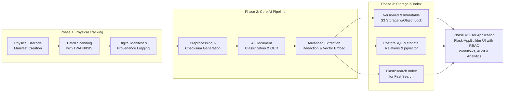

Here is the comprehensive technical product specification for "**ArchivaPro**" (or your chosen name), incorporating all advanced requirements and the Flask-AppBuilder framework. This specification details a complete, enterprise-ready document intelligence platform.

### **1. Executive Summary & Core Architecture**
**ArchivaPro** is a secure, AI-driven document management platform built on **Python (Flask-AppBuilder), PostgreSQL, and AWS S3**. It transforms 4 million+ physical financial and legal documents into a searchable, analyzable digital asset with full chain-of-custody tracking from physical file cabinet to digital vault. The system enforces **departmental sovereignty** (HR, Legal) while enabling cross-functional audit and intelligence.

### **2. Enhanced System Architecture**
The system employs a **microservices-inspired backend** managed within a monolithic Flask-AppBuilder application for rapid development, with clear service boundaries.



### **3. Core Component Specifications & Technology Stack**

| Component | Technology / Service | Key Responsibilities & Features |
| :--- | :--- | :--- |
| **Physical Scan** | **TWAIN/ISIS Scanner Drivers**, PyINSANE2 | Automated batch scanning. **Barcode sheet** recognition for physical box/file indexing. |
| **Ingestion Service** | Python (Flask-AppBuilder) | Manages **physical provenance**: links scan to source location (e.g., "Warehouse A, Box 12, File 3"). |
| **Preprocessing** | OpenCV, Pillow, BLAKE3 | Image enhancement, **BLAKE3 checksum** generation for bit-rot detection. |
| **AI Processing** | **PaddleOCR**, spaCy, scikit-learn | **Unsupervised classification** (clustering) & **supervised model** for `document_type`. **NER for PII/PHI auto-redaction**. |
| **Vector Engine** | **pgvector** (PostgreSQL) | Stores multimodal embeddings for **semantic search** ("find documents about service agreements"). |
| **Data Store** | **PostgreSQL 14+**, Elasticsearch | PostgreSQL with pgvector for metadata, relationships, vectors. Elasticsearch for full-text search. |
| **File Store** | **AWS S3** (Standard, Glacier) | **Immutable versioned storage**. Lifecycle policies. **Cross-region replication** for DR. |
| **Application Framework** | **Flask-AppBuilder** | Rapid development of **CRUD UIs**, **granular RBAC**, authentication, and workflow dashboards. |
| **Frontend** | FAB's Jinja2 templates, Custom JS | WCAG 2.1 compliant interface. **PDF.js** viewer with annotation support. |

### **4. Physical Document Tracking & Automation (Key Feature)**
To track a document's physical origin, a **structured barcode system** is used:

1.  **Pre-Scan Manifest Creation**: A barcode sheet is generated for each *physical unit* (e.g., "Bank Statements 2005-2010, Carton 7B").
2.  **Scanning Automation**:
    *   The scanner (via TWAIN) is controlled by a Python service.
    *   The first page scanned is the barcode sheet, automatically associating all subsequent pages with that physical unit.
    *   The service logs: `scanner_id`, `operator`, `timestamp`, `physical_location_id` (from barcode).
3.  **Database Schema for Provenance**:
```sql
CREATE TABLE physical_manifest (
    id UUID PRIMARY KEY,
    barcode VARCHAR(100) UNIQUE,
    description TEXT, -- "HR Records, Box 42, Shelf 3"
    location_path VARCHAR(512), -- "Building A/Room 405/Shelf-3"
    responsible_person VARCHAR(100)
);
CREATE TABLE document (
    id UUID PRIMARY KEY,
    physical_manifest_id UUID REFERENCES physical_manifest(id), -- CRITICAL LINK
    scan_operator VARCHAR(100),
    scanner_device_id VARCHAR(50),
    ingestion_timestamp TIMESTAMPTZ,
    -- ... other fields
);
```

### **5. Expanded PostgreSQL Database Schema (Critical Tables)**
```sql
-- Core document with provenance
CREATE TABLE document (
    id UUID PRIMARY KEY DEFAULT gen_random_uuid(),
    physical_manifest_id UUID REFERENCES physical_manifest(id),
    document_type VARCHAR(50) CHECK (document_type IN ('invoice','contract','po','hr_record')), -- ENUM
    department_owner VARCHAR(50) CHECK (department_owner IN ('hr','legal','finance')),
    s3_key_versioned VARCHAR(1024), -- Stores versioned object key
    file_checksum BLAKE3, -- For integrity
    created_on TIMESTAMPTZ,
    modified_on TIMESTAMPTZ
);
-- Versioning & Integrity
CREATE TABLE document_version (
    id SERIAL PRIMARY KEY,
    document_id UUID REFERENCES document(id) ON DELETE CASCADE,
    version_number INTEGER,
    s3_key VARCHAR(1024),
    checksum BLAKE3,
    user_id UUID,
    change_description TEXT
);
-- AI Extracted Data
CREATE TABLE document_metadata (
    id SERIAL PRIMARY KEY,
    document_id UUID REFERENCES document(id) ON DELETE CASCADE,
    field_name VARCHAR(100),
    field_value TEXT,
    redacted BOOLEAN DEFAULT FALSE -- For PII redaction flag
);
-- Vector Store for Semantic Search
CREATE TABLE document_embedding (
    id SERIAL PRIMARY KEY,
    document_id UUID REFERENCES document(id) ON DELETE CASCADE,
    embedding VECTOR(768) -- pgvector column
);
```

### **6. Advanced Feature Implementation Details**

| Feature Area | Implementation Strategy |
| :--- | :--- |
| **Data Integrity & Resilience** | **S3 Versioning + Object Lock** for immutability. **BLAKE3 checksums** verified annually. **RPO < 5 min** via WAL archiving; **RTO < 1 hr** via PostgreSQL replica in another region. |
| **Advanced AI/ML** | **Two-stage classification**: 1) Clustering (HDBSCAN) on embeddings finds unknown types; 2) Supervised model (BERT) tags final type. **Anomaly Detection**: Scikit-learn Isolation Forest on invoice metadata. **Vector Search**: `pgvector` with HNSW indexing for `<=>` similarity search. |
| **User Experience** | **Flask-AppBuilder** for native workflows. **pdf.js** integrated for annotations. **Bulk API** endpoints use Celery for async tasks. **WCAG 2.1** compliance via ARIA labels and PDF/UA compliance. |
| **Metadata & Taxonomy** | **Controlled Vocabularies** enforced via PostgreSQL `CHECK` constraints and separate taxonomy tables. **Provenance Tracking** via `physical_manifest` and scan logs. |

### **7. Security, Compliance & Permission Model**
*   **Granular RBAC**: Flask-AppBuilder's built-in `roles` and `permissions` model is extended with a **departmental ownership** filter. Views are automatically filtered by `department_owner`.
*   **Field-Level Security**: The `redacted` flag in `document_metadata` triggers **real-time blackout** in the UI and PDF render for unauthorized roles.
*   **Audit Trail**: All CRUD operations, document accesses, and permission changes are logged to a dedicated `audit_log` table, immutable by application users.

### **8. Implementation Roadmap (Phased)**

| Phase | Duration | Focus | Key Deliverables |
| :--- | :--- | :--- | :--- |
| **Phase 1: Foundation** | Months 1-3 | Core pipeline, physical tracking, basic FAB UI. | 1. Working scan-to-S3 pipeline with provenance.<br>2. Basic FAB application with document list/view.<br>3. PostgreSQL schema v1. |
| **Phase 2: Intelligence** | Months 4-6 | AI/ML integration, advanced search, security. | 1. Auto-classification & NER redaction models.<br>2. Semantic (pgvector) & full-text (ES) search.<br>3. Complete RBAC & audit logging. |
| **Phase 3: Resilience & Scale** | Months 7-9 | Data integrity, disaster recovery, bulk operations. | 1. S3 Object Lock, checksum validation cron jobs.<br>2. Cross-region replication & documented RPO/RTO.<br>3. Bulk metadata update & export APIs. |
| **Phase 4: Collaboration** | Months 10-12 | User workflows, analytics, accessibility. | 1. Annotation, approval workflows, dashboards.<br>2. WCAG 2.1 compliant UI.<br>3. Advanced analytics (timeline, anomaly reports). |

This specification provides a complete blueprint for a secure, intelligent, and compliant document management platform. The integration of **physical tracking** and **Flask-AppBuilder** addresses your core operational and security needs directly.

To move forward, the next critical steps are:
1.  **Finalize the Controlled Vocabulary**: Define the exact `CHECK` constraint lists for `document_type` and `department_owner`.
2.  **Design the Barcode Schema**: Determine the information encoded in the physical barcode (e.g., `LOCATION-BOX-FILE`).
3.  **Procure & Test Scanning Hardware**: Validate scanner compatibility with PyINSANE2 and the barcode reading process.

Would you like to delve deeper into the design of any specific component, such as the anomaly detection model or the structure of the Flask-AppBuilder permission views?